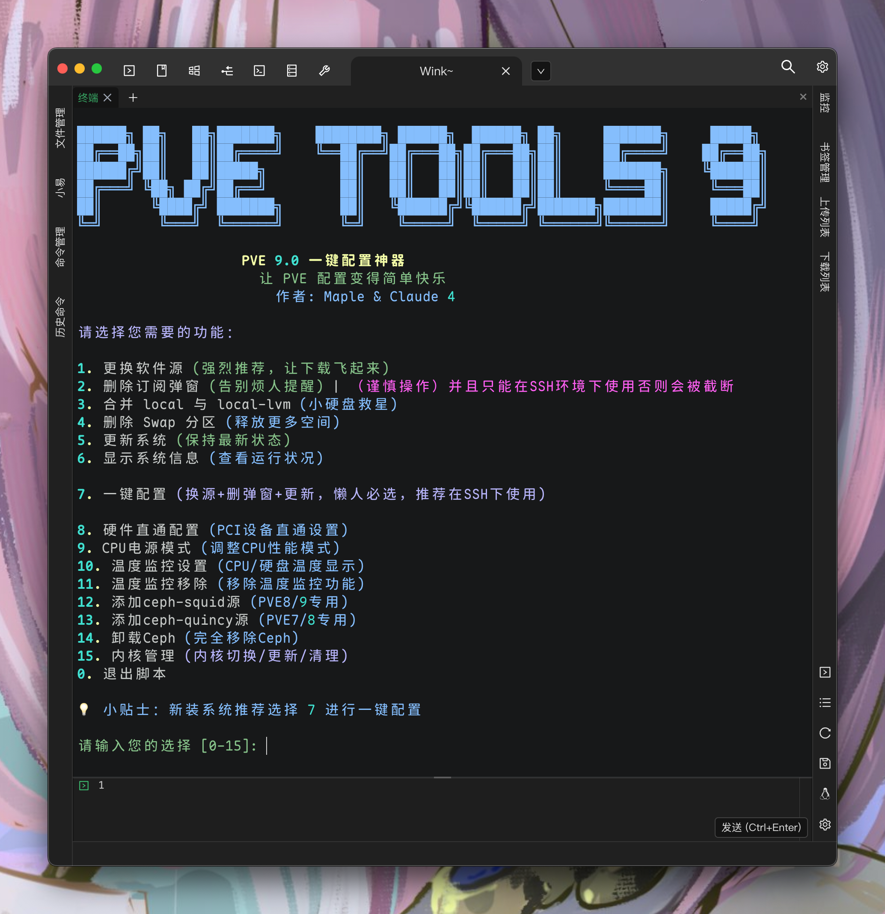

# PVE Tools 9 🚀

<div align="center">

[](https://opensource.org/licenses/MIT)
[](https://www.gnu.org/software/bash/)
[](https://www.proxmox.com/)
[-A81D33?logo=debian&logoColor=white)](https://www.debian.org/)

**🌍 Language / Language Selection**

[🇺🇸 English](./README-EN.md) | [🇨🇳 中文](./README.md)

---
```
██████╗ ██╗   ██╗███████╗    ████████╗ ██████╗  ██████╗ ██╗     ███████╗     █████╗ 
██╔══██╗██║   ██║██╔════╝    ╚══██╔══╝██╔═══██╗██╔═══██╗██║     ██╔════╝    ██╔══██╗
██████╔╝██║   ██║█████╗         ██║   ██║   ██║██║   ██║██║     ███████╗    ╚██████║
██╔═══╝ ╚██╗ ██╔╝██╔══╝         ██║   ██║   ██║██║   ██║██║     ╚════██║     ╚═══██║
██║      ╚████╔╝ ███████╗       ██║   ╚██████╔╝╚██████╔╝███████╗███████║     █████╔╝
╚═╝       ╚═══╝  ╚══════╝       ╚═╝    ╚═════╝  ╚═════╝ ╚══════╝╚══════╝     ╚════╝ 
```

** Your next “one-script-to-rule-them-all” for PVE9 **




</div>

---
### 🚪 Let's get started right away
#### 中国大陆网络
```
bash <(curl -sSL https://ghfast.top/github.com/Mapleawaa/PVE-Tools-9/blob/main/PVE-Tools.sh)
```
#### 国际网络
```
bash <(curl -sSL https://github.com/Mapleawaa/PVE-Tools-9/blob/main/PVE-Tools.sh)
```

---

### 📖 Project Description

PVE Tools 9 is a one-click configuration tool specifically designed for **Proxmox VE 9.0**, based on the **Debian 13 (Trixie)** system. This tool aims to simplify the initial configuration of PVE, offering a user-friendly interface and a secure operational experience.

<div align="center">

**If you encounter any issues while using the script, please open an issue directly. I will check and fix them during my free time.**
**Suggestions and PRs are welcome!**

[](https://github.com/Mapleawaa/PVE-Tools-9/commits/)
</div>

### ✨ Key Features

- 🚀 **One-click source change** - Automatically configure the Tsinghua University mirror source for faster downloads
- 🚫 **Remove subscription popup** - Eliminate the annoying subscription reminder
- 💾 **Storage optimization** - Smartly merge `local` and `local-lvm` storage
- 🔄 **Swap management** - Optionally remove the Swap partition to free up space
- 📦 **System updates** - Secure system upgrades and cleanup
- 📊 **System monitoring** - Real-time display of system status
- 🔧 **Hardware passthrough** - Easily configure PCI device passthrough
- ⚙️ **CPU power management** - Flexibly adjust CPU performance modes
- 🌡️ **Temperature monitoring** - Real-time display of CPU and disk temperatures
- 🐙 **Ceph support** - Support for `ceph-squid` and `ceph-quincy` sources
- 🎨 **Colorful UI** - Colorful output and user-friendly interaction
- 🛡️ **Safe backup** - Automatically back up important files before operations

### 🎯 Supported Functions

| Function | Description | Recommendation |
|---------|-------------|----------------|
| 🚀 Change Software Sources | Configure Tsinghua mirror sources (Debian, PVE, Ceph) | ⭐⭐⭐⭐⭐ |
| 🚫 Remove Subscription Popup | Remove "no valid subscription" reminder | ⭐⭐⭐⭐⭐ |
| 💾 Merge Storage | Merge `local` and `local-lvm` (suitable for small disks) | ⭐⭐⭐ |
| 🔄 Remove Swap | Free Swap space for system use | ⭐⭐⭐ |
| 📦 System Update | Update system packages to latest version | ⭐⭐⭐⭐ |
| 📊 System Info | View PVE system status | ⭐⭐⭐⭐ |
| 🔧 Hardware Passthrough | Configure PCI device passthrough | ⭐⭐⭐⭐ |
| ⚙️ CPU Power Mode | Adjust CPU performance mode | ⭐⭐⭐ |
| 🌡️ Temperature Monitoring | Real-time display of CPU and disk temperatures | ⭐⭐⭐⭐ |
| 🐙 Ceph Sources | Support for `ceph-squid` and `ceph-quincy` sources | ⭐⭐⭐ |
| 🗑️ Ceph Removal | Completely remove Ceph components | ⭐⭐ |
| 🐧 Kernel Management | Detect, download and switch system kernel versions | ⭐⭐⭐⭐ |

### 🚀 Quick Start

#### System Requirements

- ✅ Proxmox VE 9.0 or higher
- ✅ Debian 13 (Trixie) base system
- ✅ Root privileges
- ✅ Network access

#### Installation & Usage

```bash
# 1. Download the script
wget https://raw.githubusercontent.com/Mapleawaa/PVE-Tools-9/main/PVE-Tools.sh

# 2. Add execution permission
chmod +x PVE-Tools.sh

# 3. Run the script
sudo ./PVE-Tools.sh
```

After running the script, you'll see a menu with the following options:

1. 🚀 Change Sources - Configure Tsinghua University mirror sources
2. 🚫 Remove Popup - Remove subscription reminder
3. 💾 Merge Storage - Merge local and local-lvm
4. 🔄 Remove Swap - Free up Swap space
5. 📦 System Update - Update system packages
6. 📊 System Info - View system status
7. ⚡ One-Click Setup - Automatically change sources, remove popup, and update system
8. 🔧 Hardware Passthrough - Configure PCI device passthrough
9. ⚙️ CPU Power Mode - Adjust CPU performance mode
10. 🌡️ Temperature Monitoring - Add temperature monitoring
11. 🗑️ Remove Temperature Monitoring - Remove temperature monitoring
12. 🐙 Add ceph-squid Source - Add Ceph source for PVE 8/9
13. 🐙 Add ceph-quincy Source - Add Ceph source for PVE 7/8
14. 🗑️ Remove Ceph - Completely remove Ceph components
15. 🐧 Kernel Management - Detect, download and switch kernel versions

> 💡 **Debug Mode**: For developers and advanced users, use `sudo ./PVE-Tools.sh --debug`. This mode skips PVE system detection but will display a warning, as running it on a non-PVE system may damage the system.

#### One-Click Setup (Recommended for New Users)

```bash
# Run the script and select option 7
sudo ./PVE-Tools.sh
# Then enter 7 to select one-click setup
```

### 📋 Detailed Feature Descriptions

#### 🚀 Change Software Sources

- **Debian Sources**: Configure Tsinghua University mirror using DEB822 format
- **Enterprise Sources**: Automatically comment out paid enterprise sources
- **Ceph Sources**: Configure Ceph storage mirror
- **Community Sources**: Add free version-specific sources
- **CT Template Sources**: Accelerate container template downloads

#### 🚫 Remove Subscription Popup

Automatically modifies the `proxmoxlib.js` file to completely remove the "No valid subscription" popup.

#### 💾 Storage Management

**Merge local and local-lvm**:
- Suitable for small system disks
- Automatic configuration backup
- Safe LVM operations

**Remove Swap Partition**:
- Free up Swap space for system use
- Suitable for memory-rich environments
- Automatically modifies `fstab` configuration

#### 🔧 Hardware Passthrough Configuration

**Enable Hardware Passthrough**:
- Automatically detect CPU type (Intel/AMD)
- Configure IOMMU settings
- Add VFIO driver modules
- Set GPU and audio device blacklists

**Disable Hardware Passthrough**:
- Restore original GRUB configuration
- Remove VFIO-related settings
- Delete blacklist configurations

#### ⚙️ CPU Power Modes

Supports multiple modes:
- **Performance**: High performance (default)
- **Powersave**: Power-saving mode
- **Ondemand**: On-demand frequency scaling
- **Conservative**: Conservative scaling
- **Schedutil**: Load-optimized scaling

#### 🌡️ Temperature Monitoring

**Add Temperature Monitoring**:
- Install `lm-sensors`, `nvme-cli`, etc.
- Auto-detect hardware sensors
- Modify PVE Web UI to show CPU/motherboard/hard drive temperatures
- Supports NVME and SATA disks

**Remove Temperature Monitoring**:
- Restore original PVE Web UI files
- Remove related tools and configurations

#### 🐧 Kernel Management

**Kernel Version Detection**:
- Automatically detect current system kernel version
- Display available kernel version list
- Support PVE official kernels and test versions

**Kernel Download & Installation**:
- Download specified kernel versions from PVE official repository
- Automatically handle dependencies and conflicts
- Support kernel headers and development packages installation

**Kernel Switching Configuration**:
- Safe kernel switching mechanism
- Automatically update GRUB boot configuration
- Support multi-kernel boot option management

#### 🐙 Ceph Storage Support

**Add ceph-squid Source**:
- For PVE 8/9
- Configure Tsinghua University mirror

**Add ceph-quincy Source**:
- For PVE 7/8
- Configure Tsinghua University mirror

**Remove Ceph**:
- Stop all Ceph services
- Remove Ceph-related packages
- Clean up configuration files and data

### ⚠️ Important Notes

- 🔒 **Permissions**: Must run with root privileges
- 💾 **Backups**: Configuration files are automatically backed up before important operations
- 🌐 **Network**: Source changing requires a stable network
- ⚡ **Memory**: Ensure enough memory before removing Swap
- 🔧 **Hardware Passthrough**: Requires hardware support for IOMMU/VT-d
- 🌡️ **Temperature Monitoring**: Requires hardware sensor support
- 🐙 **Ceph**: Choose the correct Ceph source based on your PVE version

### 🐛 Troubleshooting

#### Common Issues

**Q: Script says "Not a PVE environment"?**
A: Make sure you're running it on a Proxmox VE system.

**Q: Update fails after changing sources?**
A: Check your network or try re-running the source change function.

**Q: Popup still appears after removal?**
A: Clear browser cache or use incognito mode.

#### Kernel Management FAQ

**Q: Is kernel switching safe?**
A: Yes, the script automatically backs up current kernel configuration and provides rollback options. We recommend testing in a non-production environment before switching.

**Q: Which kernel versions are supported?**
A: Supports all available kernel versions in PVE official repository, including stable and testing versions.

**Q: Do I need to reboot after switching kernel?**
A: Yes, you need to reboot the system for the new kernel to take effect.

**Q: How to restore the original kernel?**
A: Select the original kernel version from GRUB boot menu to restore.

**Q: Will kernel switching affect my virtual machines?**
A: It won't directly affect virtual machines, but the new kernel may provide better hardware compatibility and performance.

#### Getting Help

If you encounter issues:
1. 📋 Check script logs
2. 🔍 Verify system meets requirements
3. 💬 Open an issue on GitHub

---

## 📄 License

This project is licensed under the **MIT License** - see the [LICENSE](LICENSE) file for details.

```
MIT License

Copyright (c) 2025 Sovitx IO

Permission is hereby granted, free of charge, to any person obtaining a copy
of this software and associated documentation files (the "Software"), to deal
in the Software without restriction, including without limitation the rights
to use, copy, modify, merge, publish, distribute, sublicense, and/or sell
copies of the Software, and to permit persons to whom the Software is
furnished to do so, subject to the following conditions:

The above copyright notice and this permission notice shall be included in all
copies or substantial portions of the Software.

THE SOFTWARE IS PROVIDED "AS IS", WITHOUT WARRANTY OF ANY KIND, EXPRESS OR
IMPLIED, INCLUDING BUT NOT LIMITED TO THE WARRANTIES OF MERCHANTABILITY,
FITNESS FOR A PARTICULAR PURPOSE AND NONINFRINGEMENT. IN NO EVENT SHALL THE
AUTHORS OR COPYRIGHT HOLDERS BE LIABLE FOR ANY CLAIM, DAMAGES OR OTHER
LIABILITY, WHETHER IN AN ACTION OF CONTRACT, TORT OR OTHERWISE, ARISING FROM,
OUT OF OR IN CONNECTION WITH THE SOFTWARE OR THE USE OR OTHER DEALINGS IN THE
SOFTWARE.
```

---

## 🙏 Special Thanks

### 🌟 Contributors

- **Maple** - Project Creator & Main Maintainer
- **Community Contributors** - Thanks to all users who provided feedback and suggestions
- **xiangfeidexiaohuo** - Thanks for the sensor monitoring idea

### 🏛️ Organizations & Projects

- **[Tsinghua University TUNA](https://mirrors.tuna.tsinghua.edu.cn/)** - Mirror source provider
- **[Proxmox VE](https://www.proxmox.com/)** - Excellent virtualization platform
- **[Debian Project](https://www.debian.org/)** - Stable OS foundation

### 💡 Inspiration

- Thanks to PVE community for sharing configuration guides
- Inspired by [this article](https://zhichao.org/posts/e0fe08)
- Referenced best practices from many open-source projects

### 🎨 Design & UI

- ASCII art inspired by community creations
- Color scheme references modern terminal aesthetics

---

<div align="center">

### 🌟 If this project helps you, please give it a Star ⭐

**Made with ❤️ by AI Claude 4 && Qwen3**
[**Qwen3** is the large language model series developed by Qwen team, Alibaba Cloud. ](https://github.com/QwenLM/Qwen3)

[](https://github.com/Mapleawaa)

</div>